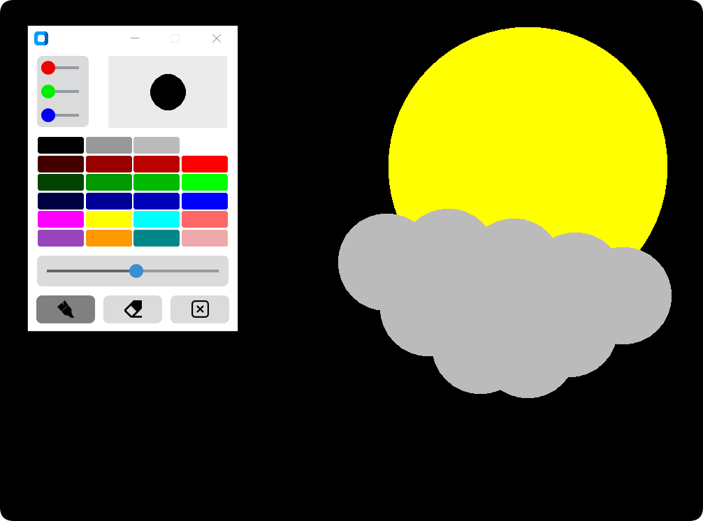

# PAINTER GUI APPLICATION

    <em>
        The Painter GUI application offers an accessible and straightforward platform for digital drawing and creativity. With its simple interface, the application allows users to draw freehand with smooth lines, choose from a range of colors to customize their artwork, and easily erase or modify basically. In addition to basic drawing tools, it includes adjustable brush sizes and an intuitive color palette for creating diverse designs. Designed to cater to both beginners and those who enjoy casual digital painting, the Painter GUI application makes it easy to explore creativity, experiment with different techniques, and bring ideas to life with minimal effort.
    </em>

